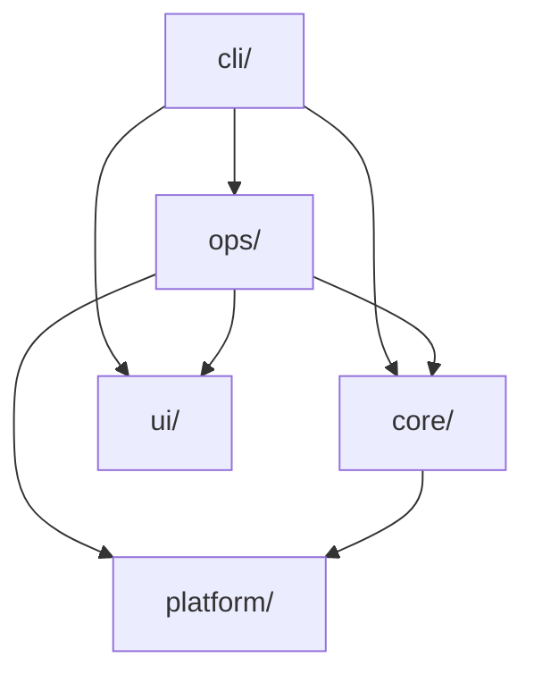

# TSI Architecture

## Current Implementation (Rust)

TSI is implemented in Rust with a single static binary and zero runtime dependencies.

### Advantages

- **Cross-platform**: macOS, Linux, Windows
- **Single binary**: Statically linked, no shared libraries required
- **Built-in HTTP**: No system curl needed for downloads
- **Built-in archive extraction**: No system tar/unzip needed
- **Memory safety**: Rust guarantees prevent common C pitfalls
- **Easy bootstrap**: Pre-built binaries available; or `cargo build --release` from source
- **Distribution independent**: Works on any supported OS

### Implementation Details

- **Language**: Rust (edition 2021)
- **Build System**: Cargo
- **Dependencies**: Minimal crates (serde, clap, ureq, etc.)
- **Output**: Single executable (`tsi` or `tsi.exe`)

### Module Layout

```
src/
├── main.rs           # Entry point
├── lib.rs            # Library root
├── cli/              # Command-line interface
│   ├── mod.rs        # Clap parser, command dispatch
│   ├── install.rs
│   ├── uninstall.rs
│   ├── upgrade.rs
│   ├── list.rs
│   ├── search.rs
│   ├── info.rs
│   ├── update.rs
│   └── doctor.rs
├── core/             # Core data structures and logic
│   ├── mod.rs
│   ├── package.rs    # Package manifest parsing
│   ├── registry.rs   # Package repository loading
│   ├── resolver.rs   # Dependency resolution
│   ├── database.rs   # Installed package tracking
│   └── config.rs     # Configuration (tsi.toml)
├── ops/              # Operations (fetch, build, install)
│   ├── mod.rs
│   ├── fetch.rs      # Git clone, HTTP download, archive extraction
│   ├── build.rs      # Autotools, CMake, Meson, Make
│   ├── install.rs    # Copy artifacts to prefix
│   ├── uninstall.rs  # Remove installed package
│   └── link.rs       # Symlink management
├── ui/               # User-facing output
│   ├── mod.rs
│   ├── output.rs     # Homebrew-style output
│   ├── progress.rs   # Progress indicators
│   └── table.rs      # Tabular display
└── platform/         # Platform-specific code
    ├── mod.rs        # os_name(), default_prefix(), resolve_prefix()
    ├── unix.rs       # Unix-specific paths and behavior
    └── windows.rs    # Windows-specific paths and behavior
```

### Core Components

1. **Package** (`core/package.rs`)
   - JSON manifest parsing
   - Package metadata handling
   - Dependency tracking

2. **Registry** (`core/registry.rs`)
   - Package manifest loading
   - Repository directory scanning
   - Package lookup

3. **Resolver** (`core/resolver.rs`)
   - Topological sorting
   - Dependency graph construction
   - Build order determination

4. **Database** (`core/database.rs`)
   - Installed package tracking
   - JSON-based storage
   - Package metadata persistence

5. **Config** (`core/config.rs`)
   - `tsi.toml` parsing
   - User preferences and overrides

6. **Fetch** (`ops/fetch.rs`)
   - Git repository cloning
   - HTTP download (built-in)
   - Archive extraction (built-in)
   - Local source handling

7. **Build** (`ops/build.rs`)
   - Autotools support
   - CMake support
   - Meson support
   - Plain Makefile support
   - Custom build commands

8. **CLI** (`cli/`)
   - Command-line interface (clap)
   - Subcommands: install, uninstall, upgrade, list, search, info, update, doctor
   - Argument parsing and dispatch

9. **Platform** (`platform/`)
   - `os_name()`: darwin, linux, windows, freebsd, etc.
   - `default_prefix()`: `~/.tsi` (Unix) or `%USERPROFILE%\.tsi` (Windows)
   - `resolve_prefix()`: User override or binary location detection

### Dependency Flow



## Design Principles

1. **Minimal Requirements**: Pre-built binary or Rust toolchain for building
2. **Source-Based**: Everything built from source
3. **Isolated Installation**: Packages installed to separate prefix
4. **Distribution Independent**: No reliance on system package managers
5. **Self-Contained**: Single binary, no runtime dependencies

## Build Process

1. `cargo build --release` produces `target/release/tsi` (or `tsi.exe` on Windows)
2. Optional: Static linking for maximum portability
3. Install to system or user directory via `make install` or bootstrap script

## Testing

- **Unit tests**: In-module `#[cfg(test)]` tests
- **Integration tests**: `tests/package_parse.rs`, `tests/resolver.rs`
- **Docker**: Minimal systems and various Linux distributions (see `docker/`)
